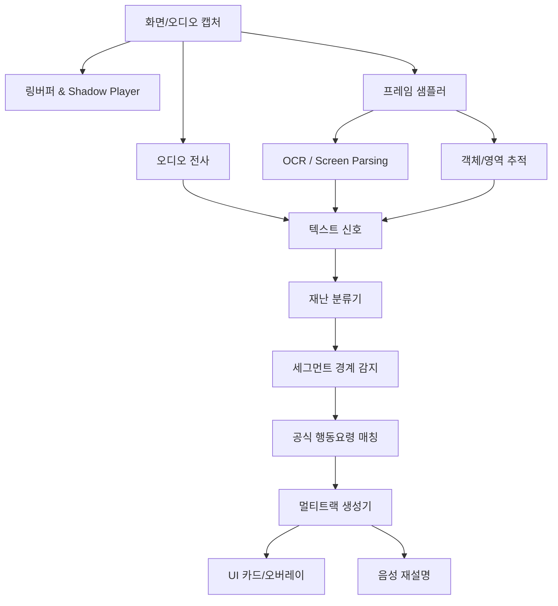

# 02_SYSTEM_ARCHITECTURE

## 전체 구조

## 계층별 설명

### 1. Capture Layer
- macOS: ScreenCaptureKit
- Windows: Windows.Graphics.Capture
- Web fallback: getDisplayMedia

### 2. Buffer Layer
- live preview stream
- 4초 지연 replay buffer
- 세그먼트 기준 pause/replay 훅

### 3. Perception Layer
- 1fps 기본 샘플링, 이벤트 발생 시 burst 4~6fps
- ASR chunk
- OCR token
- UI/screen element parsing
- region/object highlight

### 4. Grounding Layer
- 재난 유형 분류
- phase 분류
- official rules lookup
- safety fallback

### 5. Explanation Layer
- basic/easy/action/reason/caregiver/report
- 각 트랙은 strict schema로 저장
- rule ids 없는 action은 금지

### 6. Interaction Layer
- 트랙 선택
- 음성 질의
- Panic Mode
- 근거 확인
- 다시 보기

## 권장 기술 스택

### 데스크톱 앱
- Tauri 2
- React 19
- TypeScript
- Tailwind CSS
- shadcn/ui

### 네이티브 캡처
- Swift + ScreenCaptureKit (macOS)
- C# 또는 C++/WinRT + Windows.Graphics.Capture (Windows)

### 워커
- Rust 또는 Node.js
- FFmpeg
- OpenAI Responses API
- OpenAI Realtime API
- optional: Python worker for local CV/SAM2

### 데이터 저장
- SQLite (로컬)
- 파일 기반 json cache
- optional: Supabase for team sync, not required for demo

## 런타임 데이터 흐름

1. 사용자가 캡처 시작
2. 4초 버퍼 축적
3. 분석 lane가 keyframe, ASR, OCR 생성
4. hazard + phase + boundary detection
5. segment object 생성
6. rule grounding
7. track generation
8. UI 렌더 + 음성 인터랙션

## 설계 결정

- 서버 중심 아키텍처가 아니라 **로컬 우선**
- 원본 전체 업로드 금지, keyframe + text 우선
- 실시간 0초 지연보다 4초 지연이 더 중요
- 안전성 때문에 자유 생성보다 rule-matching 우선
