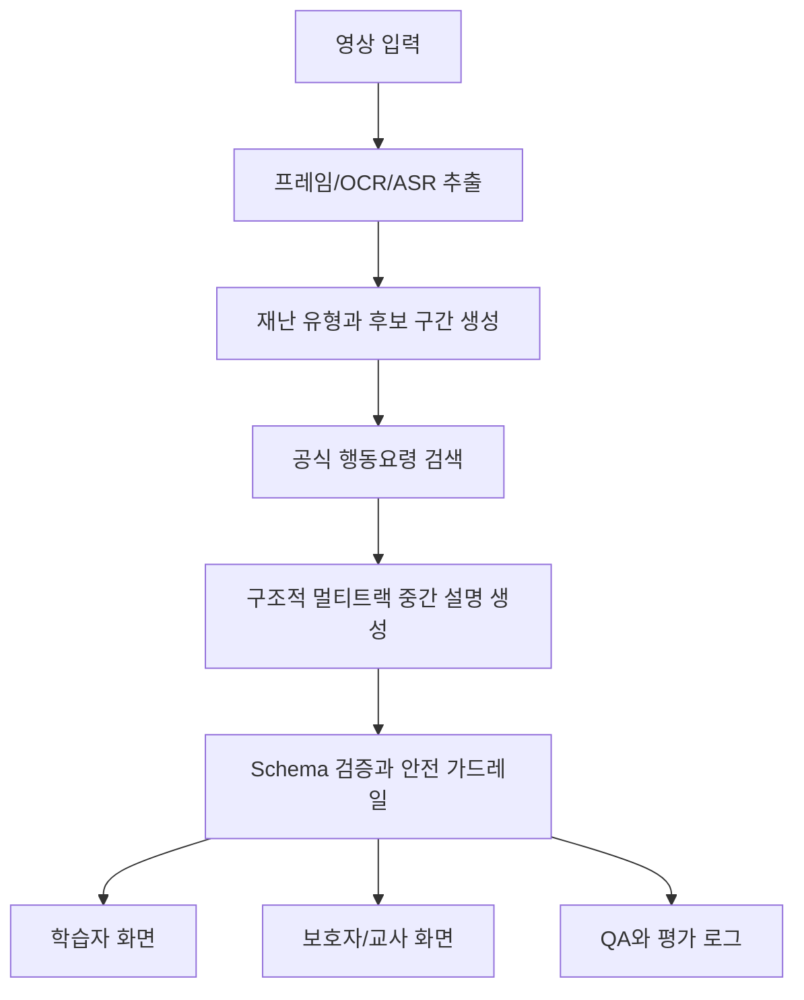

# V2A 멀티트랙 중간 설명 기술의 SlowLearner 적용 제안서

## 1. 문서 목적

이 문서는 V2A 프로젝트에서 연구하고 구현했던 **구조적 멀티트랙 중간 설명 기술**을 SlowLearner 프로젝트에 어떻게 적용할지 정리한 기술 제안서다.

SlowLearner는 느린학습자와 경계선지능인을 대상으로 재난안전 영상을 짧게 멈춰 보고, 쉬운말과 행동 카드로 반복 연습하게 하는 교육 보조 도구다. 현재 프로젝트는 이미 `쉬운말`, `지금 할 일`, `이유`, `보호자/선생님`, `신고`, `공식 근거`라는 멀티트랙 설명 구조를 일부 가지고 있다. 따라서 V2A에서 검증했던 멀티트랙 설명 생성 계약을 그대로 가져오는 것이 아니라, **오디오 생성 조건을 만들던 기술을 재난안전 행동 학습 조건을 만드는 기술로 변환**하는 것이 핵심이다.

이 제안서의 목표는 다음과 같다.

1. V2A에서 연구한 기술 중 SlowLearner에 실제로 도움이 되는 기술을 선별한다.
2. 각 기술을 SlowLearner의 제품 목적에 맞게 재정의한다.
3. 적용 후 데이터 구조, LLM 프롬프트, UI, QA, 평가 방식이 어떻게 바뀌어야 하는지 구체화한다.
4. 구현 우선순위와 위험 요소를 명확히 정리한다.
5. 향후 논문, 발표, 데모에서 기술적 기여로 설명할 수 있는 구조를 만든다.

## 2. SlowLearner 현재 구조 요약

현재 SlowLearner는 다음 방향으로 정리되어 있다.

- 기본 제품은 실시간 응급 판단 도구가 아니라 **재난안전 행동을 사전에 반복 연습하는 교육 도구**다.
- `/`는 학습 홈이다.
- `/scenario/:id`는 장면별 학습자 플레이어다.
- `/teacher`는 교사/보호자 진행자 화면이다.
- `/live-lab`는 화면공유 기반 AI 분석 실험 기능이다.
- `/qa`는 내부 운영자 검증 워크스페이스다.
- 주요 도메인은 화재와 지진이다.
- 행동 문장은 공식 재난행동요령에 근거해야 한다.
- 학습자에게는 많은 정보를 한 번에 보여주지 않고, 쉬운말과 행동 카드 중심으로 제시한다.

현재 아키텍처의 핵심 데이터 흐름은 다음과 같다.

1. 화면 또는 저장된 시나리오 영상을 입력한다.
2. 프레임, OCR, ASR, 객체 힌트 등을 추출한다.
3. 재난 유형과 장면 단계를 분류한다.
4. 세그먼트 경계를 잡는다.
5. 공식 행동요령과 매칭한다.
6. 여러 설명 트랙을 만든다.
7. 학습자 UI와 교사/보호자 UI에 표시한다.

이미 멀티트랙의 형태는 있지만, 현재 구조에서 더 강화할 수 있는 부분은 다음이다.

- LLM이 자유롭게 요약하지 못하도록 하는 강한 출력 계약
- 한 세그먼트 안에 여러 행동이 섞이는 문제 방지
- 화면 근거, 자막 근거, 음성 근거, 공식 규칙 근거의 명시적 분리
- “보이는 것”과 “행동으로 지시해도 되는 것”의 분리
- 설명 생성 실패와 학습자 이해 실패를 나눠 측정하는 평가 구조
- QA와 수동 검수 데이터가 누적될 수 있는 형식

## 3. V2A 프로젝트에서 연구한 핵심 기술

V2A 프로젝트에서 연구한 기술은 원래 비디오를 보고 오디오 생성 모델이 사용할 수 있는 멀티트랙 텍스트 설명을 만드는 데 초점이 있었다. 핵심은 자유 캡션을 쓰지 않고, 생성기가 바로 소비할 수 있는 구조적 중간 설명을 만들도록 LLM 출력을 강제하는 것이었다.

SlowLearner에 적용 가능한 기술은 다음과 같다.

### 3.1 구조적 멀티트랙 중간 설명

V2A에서는 하나의 비디오 장면을 `speech`, `sfx`, `music`, `ambience` 같은 오디오 트랙으로 나누었다. SlowLearner에서는 이 개념을 재난안전 학습에 맞게 바꿔야 한다.

SlowLearner의 권장 트랙은 다음이다.

- `easy`: 학습자에게 보여줄 쉬운말 설명
- `action`: 지금 해야 할 행동 카드
- `reason`: 왜 그렇게 해야 하는지
- `do_not`: 하지 말아야 할 행동
- `caregiver`: 보호자/교사용 보충 설명
- `report`: 신고 또는 도움 요청 안내
- `official`: 공식 행동요령 근거
- `evidence`: 화면, 자막, 음성, 규칙 근거

이 구조는 단순히 UI를 나누는 용도가 아니다. LLM이 처음부터 “한 문장 요약”이 아니라 “각 목적에 맞는 설명 단위”를 만들게 하는 생성 계약이다.

### 3.2 JSON Schema 기반 출력 강제

V2A에서 가장 중요한 안정성은 LLM이 항상 같은 구조의 JSON을 반환하게 한 점이었다. SlowLearner에서도 이 원칙은 그대로 필요하다.

재난안전 앱에서는 설명 포맷이 흔들리면 단순한 UI 오류가 아니라 안전성 문제가 된다. 예를 들어 `action` 필드에 근거 없는 행동이 들어가거나, `officialRuleIds` 없이 행동 카드가 표시되면 제품 신뢰도가 무너진다.

따라서 LLM 호출은 가능한 경우 OpenAI의 structured outputs 또는 JSON schema 기반 응답 형식을 사용해야 한다. 모델이 schema mode를 지원하지 않는 경로에서는 다음 3단계를 반드시 둔다.

1. JSON 파싱
2. Zod 또는 동등한 런타임 validator 검증
3. 실패 시 표시 금지 또는 repair job 실행

중요한 점은 repair job도 원본 결과를 그대로 덮어쓰면 안 된다는 것이다. repair job은 `repaired_from`, `repair_reason`, `invalid_fields`를 남겨야 한다.

### 3.3 후보 구간 보존과 시간 경계 축소

V2A에서는 LLM이 전체 클립을 마음대로 넓게 설명하지 못하도록 `candidate span`을 시간 외피로 제공했다. SlowLearner에서도 이 방식이 유효하다.

SlowLearner에서는 후보 구간을 다음처럼 해석한다.

- 후보 구간은 “이 안에서 하나의 행동 판단이 발생할 수 있는 시간 범위”다.
- LLM은 후보 구간을 넓힐 수 없다.
- LLM은 후보 구간 안에서 더 좁은 행동 판단 구간을 선택할 수 있다.
- 시간 경계는 실제 위험의 정답 시간이 아니라, 학습자가 멈춰 보고 판단하기 좋은 장면 범위다.

이 원칙을 적용하면 다음 문제가 줄어든다.

- 하나의 장면에서 너무 많은 행동이 한꺼번에 제시되는 문제
- 영상 전체를 하나의 긴 설명으로 처리하는 문제
- 자동 정지 위치와 행동 카드가 어긋나는 문제
- teach-back 질문이 너무 늦거나 빠르게 나오는 문제

### 3.4 한 세그먼트 = 한 판단 지점

V2A에서는 “한 claim은 한 트랙, 한 사건, 한 연속 구간”이라는 규칙을 사용했다. SlowLearner에서는 이를 다음처럼 바꿔 적용한다.

> 한 학습 세그먼트는 하나의 행동 판단 지점만 담는다.

예를 들어 화재 영상에서 다음 행동들이 한 장면에 모두 들어가면 안 된다.

- 문을 닫는다.
- 계단으로 간다.
- 엘리베이터를 타지 않는다.
- 밖으로 나가기 어려우면 대피공간으로 간다.
- 119에 신고한다.

이런 항목들은 모두 중요하지만, 느린학습자에게 한 번에 제시하면 작업기억 부담이 커진다. 따라서 세그먼트는 다음처럼 분리해야 한다.

- 세그먼트 1: 나갈 때 문을 닫는가
- 세그먼트 2: 엘리베이터 대신 계단을 선택하는가
- 세그먼트 3: 길이 막혔을 때 무리하지 않는가
- 세그먼트 4: 도움 요청을 떠올리는가

이 원칙은 SlowLearner의 교육적 목적과 직접적으로 맞는다.

### 3.5 근거 기반 생성과 억제 후보 기록

V2A에서는 화면에 보이지만 소리 낼 근거가 없는 객체를 `suppressed_candidates`에 기록했다. SlowLearner에서는 이 개념이 더 중요하다.

재난안전에서는 “보인다”와 “행동으로 지시해도 된다”가 다르다.

예를 들어 다음과 같은 경우를 구분해야 한다.

- 연기가 보인다: 화재 상황 가능성이 높다.
- 출구 표지가 보인다: 대피 방향 설명 근거가 될 수 있다.
- 엘리베이터가 보인다: “엘리베이터를 타라”가 아니라 “화재 때는 엘리베이터를 피한다”의 근거가 될 수 있다.
- 젖은 수건이 보이지 않는다: 젖은 수건 사용을 새로 지시하지 않는다.
- 사람이 뛰는 장면이 보인다: 따라 하라고 지시하지 않고, 침착한 이동으로 교정해야 한다.

따라서 SlowLearner의 LLM 출력에는 `suppressedCandidates` 또는 `notUsedCandidates`가 필요하다.

예시는 다음과 같다.

```json
{
  "candidate": "elevator",
  "reason": "화면에는 보이지만 화재 행동요령상 사용을 권장하지 않으므로 action 후보에서 제외"
}
```

이 기록은 QA와 안전성 감사에 도움이 된다.

### 3.6 근거 출처 분리

V2A에서는 vision-only 계약이 중요했다. SlowLearner에서는 반드시 vision-only일 필요는 없다. 오히려 재난안전 영상에서는 화면, 자막, 음성, 공식 규칙을 함께 써야 정확도가 올라간다.

다만 각 근거의 출처를 섞으면 안 된다. 출처가 섞이면 나중에 오류가 발생했을 때 원인을 찾을 수 없다.

권장 근거 구분은 다음이다.

- `visualEvidence`: 프레임에서 직접 보인 장면
- `ocrEvidence`: 화면 자막 또는 표지판
- `asrEvidence`: 내레이션 또는 음성 전사
- `ruleEvidence`: 공식 행동요령 ID와 문장
- `modelInference`: 위 근거를 바탕으로 모델이 추론한 내용

특히 행동 트랙은 `ruleEvidence` 없이 표시되지 않아야 한다. 화면 근거만으로는 “상황 설명”은 가능하지만, “행동 지시”는 공식 규칙 근거가 있어야 한다.

### 3.7 설명 생성 실패와 학습 실패의 분리

V2A에서는 DCS와 ARS를 나누어, 중간 설명 자체의 품질과 생성된 오디오의 실현 품질을 분리했다. SlowLearner에서도 같은 철학이 필요하다.

SlowLearner에서는 다음 두 평가를 분리할 수 있다.

1. 설명 준비성 평가
   - 생성된 멀티트랙 설명이 학습 UI에 올릴 만큼 구조적이고 안전한가
2. 학습 실현 평가
   - 학습자가 실제로 올바른 행동을 고르고 설명을 이해했는가

이 둘을 섞으면 안 된다. 학습자가 틀린 이유가 설명이 나빠서인지, 영상이 어려워서인지, 질문이 애매해서인지, 사용자 특성 때문인지 구분할 수 없기 때문이다.

### 3.8 사람 평가를 줄이는 AI 보조 QA

V2A에서는 DCS 일부 문항에 대해 AI와 사람 평가의 일치도를 분석했다. SlowLearner에서도 모든 검수를 사람이 다 할 필요는 없다. 다만 안전 관련 판단은 AI에게 완전히 맡기면 안 된다.

AI에게 맡기기 좋은 항목은 다음이다.

- JSON schema가 맞는가
- 필수 필드가 비어 있지 않은가
- `action`이 없는데 `officialRuleIds`도 없는가
- 한 세그먼트에 행동이 너무 많이 섞였는가
- 학습자용 문장이 지나치게 긴가
- 쉬운말 트랙에 어려운 단어가 많은가
- `do_not`이 실제 행동 카드와 충돌하지 않는가

사람이 반드시 봐야 하는 항목은 다음이다.

- 행동 지시가 실제로 안전한가
- 느린학습자가 이해할 수 있는 표현인가
- 불안을 과도하게 높이지 않는가
- 공식 규칙 해석이 교육적으로 적절한가
- 화면 장면과 행동 카드가 자연스럽게 연결되는가

## 4. SlowLearner에 맞춘 목표 구조

V2A 기술을 적용한 SlowLearner의 목표 구조는 다음이다.



핵심은 `E`와 `F`다. 이 단계에서 자유 요약을 구조적 학습 조건으로 바꿔야 한다.

## 5. 권장 데이터 모델

현재 `Segment`, `SegmentExplanation`, `TrackSet` 구조를 유지하되, 학습 목적에 맞게 더 엄격한 타입을 추가하는 것을 제안한다.

### 5.1 LearningSegment

```ts
type LearningSegment = {
  segmentId: string
  sessionId: string
  sourceId: string
  hazard: 'fire' | 'earthquake' | 'unknown'
  phase: string
  decisionPoint: string
  startMs: number
  endMs: number
  confidence: number
  status: 'draft' | 'validated' | 'needs_review' | 'blocked'
}
```

필드 의미는 다음이다.

- `segmentId`: 세그먼트 고유 ID
- `sessionId`: 분석 세션 ID
- `sourceId`: 영상 또는 시나리오 원본 ID
- `hazard`: 재난 유형
- `phase`: 재난 단계 또는 행동 단계
- `decisionPoint`: 이 세그먼트에서 학습자가 판단해야 하는 핵심 질문
- `startMs`, `endMs`: 자동 정지와 반복 재생에 사용할 시간 범위
- `confidence`: 모델 판단 신뢰도
- `status`: UI 표시 가능 여부

### 5.2 LearningTrackSet

```ts
type LearningTrackSet = {
  easy: {
    text: string
    maxReadingLevel: 'very_easy' | 'easy' | 'standard'
  }
  action: {
    cards: Array<{
      label: string
      order: number
      officialRuleIds: string[]
    }>
  }
  reason: {
    text: string
    officialRuleIds: string[]
  }
  doNot?: {
    text: string
    officialRuleIds: string[]
  }
  caregiver?: {
    script: string
    correctionHint: string
  }
  report?: {
    text: string
    emergencyNumbers: string[]
    condition: string
  }
}
```

기존 `TrackSet`의 단순 문자열 구조보다 더 명시적이다. 특히 `action.cards`가 공식 rule id를 반드시 갖도록 강제할 수 있다.

### 5.3 EvidenceBundle

```ts
type EvidenceBundle = {
  visualEvidence: Array<{
    frameTimeMs: number
    observation: string
    bbox?: [number, number, number, number]
  }>
  ocrEvidence: Array<{
    text: string
    timeMs: number
    confidence: number
  }>
  asrEvidence: Array<{
    text: string
    startMs: number
    endMs: number
    confidence: number
  }>
  ruleEvidence: Array<{
    ruleId: string
    title: string
    matchedText: string
    sourceName: string
  }>
  modelInference: Array<{
    claim: string
    basedOn: Array<'visual' | 'ocr' | 'asr' | 'rule'>
  }>
}
```

이 구조가 있으면 설명 품질을 추적할 수 있다. 예를 들어 행동 카드가 잘못 나왔을 때 그것이 ASR 오인식 때문인지, OCR 오인식 때문인지, 공식 규칙 매칭 오류 때문인지 구분할 수 있다.

### 5.4 SuppressedCandidate

```ts
type SuppressedCandidate = {
  candidate: string
  category:
    | 'unsafe_action'
    | 'unsupported_action'
    | 'too_many_actions'
    | 'unclear_evidence'
    | 'not_for_learner'
  reason: string
  evidenceRefs: string[]
}
```

예시는 다음이다.

```json
{
  "candidate": "엘리베이터 타기",
  "category": "unsafe_action",
  "reason": "화재 상황에서 엘리베이터 이용은 공식 행동요령과 충돌하므로 행동 카드에서 제외",
  "evidenceRefs": ["KR_FIRE_03"]
}
```

### 5.5 최종 통합 타입

```ts
type StructuredLearningExplanation = {
  version: 'slowlearner_multitrack_v1'
  segment: LearningSegment
  tracks: LearningTrackSet
  evidence: EvidenceBundle
  suppressedCandidates: SuppressedCandidate[]
  validation: {
    schemaValid: boolean
    hasGroundedAction: boolean
    learnerSafe: boolean
    requiresHumanReview: boolean
    warnings: string[]
  }
}
```

이 타입이 SlowLearner의 “구조적 멀티트랙 중간 설명” 표준이 될 수 있다.

## 6. LLM 생성 계약

SlowLearner에서 LLM은 자유롭게 설명하는 역할이 아니라, 구조화된 학습 조건을 만드는 역할이어야 한다. 따라서 프롬프트는 다음 원칙을 따라야 한다.

### 6.1 입력 계약

LLM에 넣는 입력은 다음으로 제한한다.

- 후보 세그먼트 시간 범위
- 샘플 프레임 관찰
- OCR 텍스트
- ASR 텍스트
- 재난 유형 후보
- 공식 행동요령 후보
- 이전/다음 세그먼트의 최소 맥락

입력하면 안 되는 것은 다음이다.

- 파일명에서 유추한 재난 유형
- 데이터셋 라벨
- 검수자가 미리 적은 정답 행동
- 출처가 불분명한 요약문
- 모델이 만든 이전 실패 결과를 근거처럼 사용하는 것

### 6.2 출력 계약

LLM은 다음 규칙을 지켜야 한다.

1. JSON만 반환한다.
2. 한 세그먼트에는 하나의 판단 지점만 둔다.
3. 행동 카드는 공식 rule id 없이는 만들 수 없다.
4. 학습자용 문장은 짧고 직접적이어야 한다.
5. 보호자/교사용 설명은 학습자용 설명보다 자세할 수 있다.
6. 화면 근거와 공식 규칙 근거를 구분한다.
7. 불확실하면 행동 지시를 만들지 않고 review 상태로 둔다.
8. 위험한 후보는 suppressedCandidates에 남긴다.
9. `startMs`, `endMs`는 후보 구간 밖으로 나갈 수 없다.
10. 실제 위험 상황 판단 도구처럼 표현하지 않는다.

### 6.3 프롬프트 초안

아래는 SlowLearner용 generation prompt의 방향이다.

```text
You are a conservative disaster-safety learning segment planner.

Your job is not to summarize the video.
Your job is to convert evidence from the current candidate span into one structured learning segment for slow learners.

Return JSON only.

Core rules:
1. Use only the provided visual, OCR, ASR, and official rule evidence.
2. Do not create an action card unless it is grounded in officialRuleIds.
3. One segment must contain one learner decision point.
4. Keep learner-facing text short and concrete.
5. Separate easy explanation, action cards, reason, do-not guidance, caregiver script, report guidance, evidence, and suppressed candidates.
6. If evidence is weak, set status to needs_review instead of guessing.
7. Never present this as real-time emergency advice.
```

실제 시스템에는 영어 프롬프트와 한국어 출력 요구를 함께 두는 것이 좋다. 모델 제어력은 영어 프롬프트가 안정적이고, 사용자 출력은 한국어로 고정하면 된다.

## 7. SlowLearner 멀티트랙 정의

### 7.1 easy 트랙

목적은 학습자가 장면을 보고 바로 이해하는 것이다.

규칙은 다음이다.

- 한 문장 또는 두 문장 이하
- 어려운 한자어 최소화
- 추상어보다 행동어 사용
- “침착하게” 같은 추상 표현만 단독으로 쓰지 않음
- 실제 위험 시 앱보다 119, 112, 주변 어른, 현장 안내가 우선이라는 문맥 유지

좋은 예시는 다음이다.

- “불이 나면 문을 닫고 밖으로 나가요.”
- “흔들릴 때는 책상 아래에서 머리를 보호해요.”

나쁜 예시는 다음이다.

- “비상 상황 발생 시 적절한 대피 절차를 수행합니다.”
- “재난 환경에서 행동 요령을 숙지합니다.”

### 7.2 action 트랙

목적은 지금 장면에서 학습자가 고를 수 있는 행동 카드를 만드는 것이다.

규칙은 다음이다.

- 1개에서 3개 행동만 허용
- 각 행동은 짧은 동사형
- 공식 rule id 필수
- 행동 순서가 있으면 order 부여
- 불확실하면 action 생성 금지

예시는 다음이다.

```json
{
  "cards": [
    {
      "label": "문을 닫아요",
      "order": 1,
      "officialRuleIds": ["KR_FIRE_04"]
    },
    {
      "label": "계단으로 가요",
      "order": 2,
      "officialRuleIds": ["KR_FIRE_03"]
    }
  ]
}
```

### 7.3 reason 트랙

목적은 행동의 이유를 짧게 설명하는 것이다.

규칙은 다음이다.

- 학습자가 물었을 때만 펼쳐 보여도 된다.
- 과도한 공포 표현 금지
- 공식 규칙과 연결
- 원인과 결과를 짧게 설명

예시는 다음이다.

- “문을 닫으면 연기가 천천히 퍼져요.”
- “엘리베이터는 멈출 수 있어서 위험해요.”

### 7.4 do_not 트랙

목적은 위험한 선택을 분명히 막는 것이다.

규칙은 다음이다.

- action과 충돌하지 않아야 한다.
- “하지 마세요”만 반복하지 않고 이유를 짧게 붙인다.
- 사용자에게 죄책감을 주는 표현은 피한다.

예시는 다음이다.

- “화재 때는 엘리베이터를 타지 않아요.”
- “연기가 많은 길을 억지로 지나가지 않아요.”

### 7.5 caregiver 트랙

목적은 보호자나 교사가 학습자의 오해를 바로잡도록 돕는 것이다.

내용은 다음을 포함할 수 있다.

- 관찰할 점
- 질문 스크립트
- 오답 교정 문장
- 실제 장소로 일반화하는 힌트

예시는 다음이다.

```json
{
  "script": "문을 닫는 행동은 연기와 불길이 퍼지는 것을 늦추기 위한 연습입니다.",
  "correctionHint": "엘리베이터를 고르면 멈출 수 있어서 위험하다고 짧게 설명합니다."
}
```

### 7.6 report 트랙

목적은 도움 요청을 다루는 것이다.

규칙은 다음이다.

- 실제 긴급 상황에서는 119, 112, 주변 어른, 현장 안내 우선
- 신고 문장은 단순하게
- 모든 장면에 무조건 신고 트랙을 만들지 않음

예시는 다음이다.

- “위험하면 119에 알려요.”
- “혼자 판단하기 어려우면 주변 어른에게 바로 말해요.”

### 7.7 official 트랙

목적은 내부 근거와 교사/보호자 확인이다.

학습자 기본 화면에는 공식 rule id를 직접 보여줄 필요가 없다. 하지만 내부 데이터에는 반드시 남겨야 한다.

## 8. 파이프라인 적용 설계

### 8.1 입력 준비 단계

현재 SlowLearner의 perception packet은 프레임, OCR, ASR, object hints를 포함한다. 여기에 다음 필드를 추가하는 것을 제안한다.

- `candidateSpans`: 후보 학습 구간
- `candidateDecisionPoints`: 가능한 판단 지점
- `ruleCandidates`: 공식 규칙 후보
- `unsafeActionCandidates`: 금지 또는 주의해야 할 행동 후보

예시는 다음이다.

```json
{
  "candidateSpans": [
    {
      "id": "span_001",
      "startMs": 0,
      "endMs": 7800,
      "reason": "문 닫기와 대피 시작 장면"
    }
  ],
  "ruleCandidates": [
    {
      "ruleId": "KR_FIRE_04",
      "title": "문을 닫고 대피",
      "matchReason": "ASR과 OCR에 현관문, 계단, 대피가 등장"
    }
  ]
}
```

### 8.2 세그먼트 후보 생성 단계

후보 생성은 LLM보다 deterministic heuristic이 먼저 담당하는 것이 안전하다.

추천 방식은 다음이다.

1. 장면 전환, 자막 전환, ASR 문장 경계를 기준으로 넓은 후보 구간 생성
2. 공식 규칙 매칭 결과가 바뀌는 지점에서 후보 분리
3. 하나의 후보 구간에 rule 후보가 너무 많으면 더 잘게 분할
4. LLM은 후보 구간 안에서만 판단 지점과 설명을 생성

이렇게 하면 LLM이 시간과 구조를 모두 임의로 결정하는 위험을 줄일 수 있다.

### 8.3 공식 규칙 매칭 단계

현재 `matchGroundedRules`는 이미 중요한 기반이다. 여기에 다음 보강이 필요하다.

- rule 후보 점수와 evidence trace 저장
- rule id가 붙은 행동만 action 카드 허용
- rule match가 약하면 `needs_review`
- 동일 세그먼트에 충돌하는 rule이 있으면 action 생성 차단

충돌 예시는 다음이다.

- “대피한다”와 “대피하지 말고 대피공간으로 간다”가 동시에 후보로 잡힌 경우
- “밖으로 나간다”와 “흔들림이 멈출 때까지 기다린다”가 동시에 잡힌 경우

### 8.4 멀티트랙 생성 단계

LLM은 다음 입력을 받아야 한다.

- 하나의 후보 span
- 공식 rule 후보
- 시각/OCR/ASR 근거
- 현재 학습자 난이도 정책
- 출력 schema

출력은 `StructuredLearningExplanation`이어야 한다.

### 8.5 검증 단계

생성 직후 다음 검증을 해야 한다.

- JSON schema 검증
- 시간 범위 검증
- action rule id 존재 검증
- action과 do_not 충돌 검증
- 쉬운말 길이 검증
- 세그먼트당 행동 수 검증
- 금지어 또는 과도한 공포 표현 검증
- 공식 근거 없는 행동 지시 차단

검증 실패 시 UI는 다음 중 하나를 선택해야 한다.

- 해당 세그먼트를 표시하지 않음
- 보호자 화면에만 review 상태로 표시
- 쉬운말만 표시하고 action 카드는 숨김
- 데모 모드에서는 curated fallback 사용

### 8.6 UI 표시 단계

학습자 화면은 다음 순서가 좋다.

1. 짧은 영상 장면
2. 쉬운말 설명
3. 행동 카드
4. 질문
5. 정답 후 이유

보호자/교사 화면은 다음 정보를 추가로 보여준다.

- 공식 rule id
- 근거 문장
- 오답 교정 스크립트
- suppressedCandidates
- confidence와 review 상태

## 9. 평가 구조 제안

V2A에서 DCS/ARS를 나눴던 것처럼, SlowLearner도 생성 전/후 평가를 나눌 수 있다.

### 9.1 LRS: Learning Readiness Score

LRS는 생성된 구조적 설명이 학습에 투입될 준비가 되었는지 보는 점수다. 사람 또는 QA 에이전트가 평가한다.

권장 질문은 다음이다.

1. 필요한 행동 트랙이 빠지지 않았는가
2. 행동 카드가 공식 규칙에 근거하는가
3. 한 세그먼트에 하나의 판단 지점만 있는가
4. 쉬운말 설명이 학습자에게 충분히 짧고 구체적인가
5. 이유 설명이 행동과 자연스럽게 연결되는가
6. 하지 말아야 할 행동이 필요한 경우 명확히 제시되는가
7. 보호자/교사용 설명이 오해 교정에 도움이 되는가
8. 화면/OCR/ASR/공식 규칙 근거가 구분되어 있는가

### 9.2 LAS: Learner Action Score

LAS는 실제 학습자가 장면을 보고 올바른 행동을 고를 수 있는지 보는 점수다.

권장 측정은 다음이다.

1. 첫 시도에서 올바른 행동 카드 선택 여부
2. 이유 설명을 본 뒤 재시도 성공 여부
3. teach-back 질문 정답 여부
4. 같은 장면 반복 후 기억 여부
5. 보호자 도움 없이 이해 가능한지
6. 불안하거나 어려워서 중단했는지

### 9.3 평가 분리의 이유

LRS와 LAS를 나누면 다음을 구분할 수 있다.

- 설명이 잘못되어 학습자가 틀린 경우
- 설명은 좋지만 영상 자체가 어려운 경우
- 행동 카드는 맞지만 질문 문장이 어려운 경우
- 학습자는 맞췄지만 보호자 설명이 부족한 경우

이 구조는 SlowLearner의 제품 개선에 직접 도움이 된다.

## 10. QA 자동화와 사람 검수 분담

### 10.1 자동 검사 가능 항목

자동화 또는 AI 보조로 처리할 수 있는 항목은 다음이다.

- schema valid 여부
- 필수 필드 존재 여부
- `action.cards.length <= 3`
- `officialRuleIds` 없는 action 존재 여부
- `startMs < endMs`
- 후보 span 밖 시간 사용 여부
- easy text 길이
- 어려운 단어 사용 비율
- action과 do_not의 명시적 충돌
- rule id가 catalog에 존재하는지

### 10.2 사람 검수 필요 항목

사람이 봐야 하는 항목은 다음이다.

- 학습자가 실제로 이해할 수 있는 표현인지
- 불안을 과도하게 유발하지 않는지
- 행동 카드가 교육적으로 타당한지
- 공식 규칙 해석이 맞는지
- 장면과 질문의 연결이 자연스러운지
- 보호자/교사용 설명이 현장 지도에 도움이 되는지

### 10.3 검수 로그 구조

```ts
type LearningReviewSubmission = {
  reviewerId: string
  segmentId: string
  submittedAt: string
  lrsAnswers: Record<string, 'yes' | 'no' | 'na'>
  learnerSimulationNotes?: string
  blockedReason?: string
  approvedForLearner: boolean
}
```

## 11. 기술별 적용 우선순위

### P0: 반드시 적용

1. 구조적 멀티트랙 JSON schema
2. action에는 공식 rule id 필수
3. 세그먼트당 하나의 판단 지점
4. evidence source 분리
5. schema validation과 fallback

이 다섯 가지는 제품 안전성과 직결된다.

### P1: 강하게 추천

1. suppressedCandidates 기록
2. 후보 span 보존과 시간 경계 축소
3. 보호자/교사용 track 강화
4. LRS 평가 워크스페이스
5. AI 보조 QA

### P2: 후속 연구/고도화

1. 실제 느린학습자 대상 LAS 수집
2. LRS와 LAS 관계 분석
3. 개인별 난이도 조절
4. 음성 재설명 track 자동 생성
5. rule catalog 확장

## 12. 기존 코드에 대한 변경 제안

### 12.1 `packages/shared-types`

추가할 타입은 다음이다.

- `LearningSegment`
- `LearningTrackSet`
- `EvidenceBundle`
- `SuppressedCandidate`
- `StructuredLearningExplanation`
- `LearningReviewSubmission`

Zod schema도 함께 추가해야 한다.

### 12.2 `workers/llm-orchestrator`

추가할 기능은 다음이다.

- `buildStructuredLearningExplanation`
- `validateLearningExplanation`
- `repairLearningExplanation`
- `applyLearningSafetyGuardrails`

기존 `buildGroundedExplanation`은 유지하되, 새 구조로 점진적으로 이전할 수 있다.

### 12.3 `workers/perception-pipeline`

추가할 기능은 다음이다.

- 후보 span 생성
- decision point 후보 생성
- evidence ref ID 부여
- OCR/ASR/visual evidence 정규화

### 12.4 `apps/desktop-ui`

UI 변경은 다음이다.

- 학습자 화면은 현재처럼 단순하게 유지
- 내부 데이터는 새 structured explanation 사용
- 교사 화면에 evidence, rule, suppressedCandidates 표시
- QA 화면에 LRS 평가 카드 추가

### 12.5 `data/rules`

공식 행동요령 rule record에 다음 필드를 추가하는 것이 좋다.

- `learnerActionLabel`
- `easyReason`
- `doNotExamples`
- `phaseAliases`
- `unsafeConfusions`

예시는 다음이다.

```json
{
  "id": "KR_FIRE_03",
  "title": "화재 시 계단 이용",
  "learnerActionLabel": "계단으로 가요",
  "easyReason": "엘리베이터는 멈출 수 있어요.",
  "doNotExamples": ["엘리베이터 타기"],
  "unsafeConfusions": ["빠르게 아무 출구로나 뛰기"]
}
```

## 13. 구현 로드맵

### 13.1 1단계: 타입과 검증기 추가

목표는 데이터 계약을 먼저 고정하는 것이다.

작업 항목은 다음이다.

1. shared-types에 새 schema 추가
2. fixture 2개를 새 schema로 변환
3. validation test 작성
4. 기존 UI가 새 구조를 읽을 수 있는 adapter 추가

완료 기준은 다음이다.

- 기존 시나리오가 깨지지 않는다.
- 새 schema validation이 통과한다.
- action에 rule id가 없으면 test가 실패한다.

### 13.2 2단계: LLM 생성 경로 연결

작업 항목은 다음이다.

1. structured output prompt 작성
2. JSON schema mode 또는 validator 기반 호출 구현
3. `buildStructuredLearningExplanation` 추가
4. 실패 시 fallback 처리

완료 기준은 다음이다.

- 같은 입력에 대해 항상 같은 구조의 JSON이 나온다.
- schema 실패가 UI에 직접 노출되지 않는다.
- review 상태와 blocked 상태가 구분된다.

### 13.3 3단계: UI와 QA 반영

작업 항목은 다음이다.

1. 학습자 화면은 기존 단순 구조 유지
2. 교사 화면에 근거와 억제 후보 표시
3. QA 화면에 LRS 평가 추가
4. manual review log 저장

완료 기준은 다음이다.

- 보호자/교사가 “왜 이 행동 카드가 나왔는지” 확인할 수 있다.
- QA에서 세그먼트별 승인/차단 이유를 남길 수 있다.

### 13.4 4단계: 실제 학습 검증

작업 항목은 다음이다.

1. 화재/지진 각 10개 이상 세그먼트 검수
2. 보호자/교사 사용성 평가
3. teach-back 정답률 기록
4. 설명 수정 전후 비교

완료 기준은 다음이다.

- 학습자가 첫 행동을 더 잘 고르는지 확인한다.
- 어려운 표현과 오해가 많은 세그먼트를 찾는다.
- 다음 개선 우선순위를 데이터로 정한다.

## 14. 적용 예시

### 14.1 기존 방식

기존 방식의 설명은 다음처럼 단순 문자열 중심이다.

```json
{
  "basic": "화재가 났을 때 문을 닫고 계단으로 대피합니다.",
  "easy": "문을 닫고 계단으로 가요.",
  "action": "문을 닫아요. 계단으로 가요.",
  "reason": "연기가 퍼지는 것을 줄이기 위해서입니다."
}
```

이 방식은 보기에는 간단하지만 다음 문제가 있다.

- 행동이 몇 개인지 기계적으로 알기 어렵다.
- 각 행동의 공식 근거를 추적하기 어렵다.
- 학습자용 문장과 보호자용 문장이 섞일 수 있다.
- 금지 행동이 명확히 남지 않는다.
- QA가 구조적으로 어렵다.

### 14.2 제안 방식

```json
{
  "version": "slowlearner_multitrack_v1",
  "segment": {
    "segmentId": "fire_001",
    "sessionId": "demo_fire",
    "sourceId": "fire_grounded_flow",
    "hazard": "fire",
    "phase": "door_control",
    "decisionPoint": "나갈 때 문을 닫아야 하는가",
    "startMs": 0,
    "endMs": 7800,
    "confidence": 0.92,
    "status": "validated"
  },
  "tracks": {
    "easy": {
      "text": "나갈 때는 문을 닫아요.",
      "maxReadingLevel": "very_easy"
    },
    "action": {
      "cards": [
        {
          "label": "문을 닫아요",
          "order": 1,
          "officialRuleIds": ["KR_FIRE_04"]
        }
      ]
    },
    "reason": {
      "text": "문을 닫으면 연기가 천천히 퍼져요.",
      "officialRuleIds": ["KR_FIRE_04"]
    },
    "doNot": {
      "text": "문을 열어 둔 채 나가지 않아요.",
      "officialRuleIds": ["KR_FIRE_04"]
    },
    "caregiver": {
      "script": "문 닫기는 연기 확산을 늦추기 위한 행동입니다.",
      "correctionHint": "문을 열어 둔다고 답하면 연기가 더 퍼질 수 있다고 짧게 설명합니다."
    }
  },
  "evidence": {
    "visualEvidence": [
      {
        "frameTimeMs": 1200,
        "observation": "현관문과 대피 장면이 보임"
      }
    ],
    "ocrEvidence": [
      {
        "text": "현관문을 닫고 대피",
        "timeMs": 900,
        "confidence": 0.86
      }
    ],
    "asrEvidence": [
      {
        "text": "현관문을 닫고 계단으로 대피합니다.",
        "startMs": 0,
        "endMs": 3000,
        "confidence": 0.9
      }
    ],
    "ruleEvidence": [
      {
        "ruleId": "KR_FIRE_04",
        "title": "문을 닫고 대피",
        "matchedText": "문을 닫고 이동한다.",
        "sourceName": "공식 화재 행동요령"
      }
    ],
    "modelInference": [
      {
        "claim": "현재 세그먼트의 핵심 판단은 문을 닫고 대피하는 행동이다.",
        "basedOn": ["ocr", "asr", "rule"]
      }
    ]
  },
  "suppressedCandidates": [
    {
      "candidate": "엘리베이터 이용",
      "category": "unsafe_action",
      "reason": "화재 상황에서 엘리베이터 이용은 공식 행동요령과 충돌",
      "evidenceRefs": ["KR_FIRE_03"]
    }
  ],
  "validation": {
    "schemaValid": true,
    "hasGroundedAction": true,
    "learnerSafe": true,
    "requiresHumanReview": false,
    "warnings": []
  }
}
```

이 구조의 장점은 다음이다.

- UI가 각 트랙을 안정적으로 읽을 수 있다.
- QA가 어느 필드가 문제인지 바로 확인할 수 있다.
- 공식 근거 없는 행동 지시를 차단할 수 있다.
- 교사/보호자 화면과 학습자 화면을 같은 데이터에서 분리할 수 있다.
- 나중에 학습 효과와 설명 품질을 연결해 분석할 수 있다.

## 15. 안전성과 개인정보 고려

SlowLearner에 멀티트랙 기술을 적용할 때 가장 중요한 것은 안전성이다.

### 15.1 안전 원칙

- 실제 응급상황 대응 앱처럼 보이면 안 된다.
- 행동 지시는 공식 규칙에 근거해야 한다.
- 낮은 신뢰도에서는 행동 카드보다 “보호자와 확인”을 우선한다.
- 모델이 추론한 내용과 공식 근거를 구분한다.
- 불확실한 상황에서는 설명을 줄이고 review 상태로 둔다.

### 15.2 개인정보 원칙

- 화면공유 실험 기능은 `/live-lab`에 격리한다.
- 원본 화면 전체를 장기 저장하지 않는다.
- keyframe, OCR, ASR도 최소 저장한다.
- QA용 데이터는 민감정보가 없는 시나리오 영상 중심으로 구성한다.
- OpenAI API key는 서버에서만 사용하고 클라이언트에 노출하지 않는다.

## 16. 기술적 기여로 설명할 수 있는 포인트

이 기술을 적용하면 SlowLearner의 기술적 기여를 다음처럼 정리할 수 있다.

### 16.1 자유 설명이 아닌 구조적 학습 조건 생성

기존 영상 요약은 장면을 자연어로 설명하는 데 그치는 경우가 많다. SlowLearner는 이를 학습자가 바로 사용할 수 있는 행동 카드, 쉬운말, 이유, 금지 행동, 보호자 설명, 공식 근거로 분해한다.

### 16.2 공식 규칙 기반 행동 트랙

행동 카드는 LLM의 자유 생성이 아니라 공식 재난행동요령과 연결된 경우에만 표시된다. 이는 안전성이 중요한 교육 도구에서 핵심적인 차별점이다.

### 16.3 한 판단 지점 단위의 세그먼트화

영상 샷이나 자막 단위가 아니라 학습자가 실제로 선택해야 하는 행동 판단 지점 단위로 세그먼트를 구성한다. 이는 느린학습자의 작업기억 부담을 줄이는 데 직접적으로 연결된다.

### 16.4 근거와 억제 후보를 함께 저장

설명에 사용한 근거뿐 아니라 사용하지 않은 위험 후보도 저장한다. 이를 통해 왜 어떤 행동이 표시되지 않았는지 검토할 수 있다.

### 16.5 설명 준비성과 학습 실현의 분리 평가

생성된 설명이 구조적으로 좋은지와 학습자가 실제로 이해했는지를 분리해 평가할 수 있다. 이는 설명 생성 모델의 실패와 교육 UI의 실패를 구분하는 데 도움이 된다.

## 17. 예상 리스크와 대응

### 17.1 LLM이 공식 규칙을 과도하게 확장하는 문제

위험은 LLM이 공식 rule을 보고 장면에 없는 행동까지 추가하는 것이다.

대응은 다음이다.

- rule 후보를 좁혀서 제공
- 화면/OCR/ASR 근거와 연결된 rule만 action 허용
- 근거 없는 action은 validation에서 차단

### 17.2 설명이 너무 복잡해지는 문제

구조가 늘어나면 내부 데이터는 좋아지지만 학습자 UI가 복잡해질 수 있다.

대응은 다음이다.

- 학습자 화면에는 `easy`, `action`, `question`만 기본 표시
- `reason`은 접어두기
- `caregiver`, `official`, `evidence`는 교사 화면에만 표시

### 17.3 시간 경계가 부정확한 문제

장면 멈춤 위치가 어긋나면 학습자가 혼란스러울 수 있다.

대응은 다음이다.

- 후보 span은 heuristic으로 넓게 잡고 LLM은 좁히기만 허용
- 교사/QA가 start/end를 수정할 수 있게 함
- 자동 정지 직후 썸네일과 설명을 함께 검수

### 17.4 사람 검수 비용 증가

구조가 세밀해지면 검수해야 할 필드가 많아진다.

대응은 다음이다.

- schema/길이/rule id/충돌 검사는 자동화
- 사람은 안전성, 이해도, 교육 적합성만 검수
- 검수 UI는 yes/no/해당없음 중심으로 단순화

## 18. 성공 기준

적용 성공 기준은 다음이다.

### 18.1 기술 기준

- 모든 생성 결과가 schema validation을 통과한다.
- 공식 rule id 없는 action 카드가 UI에 표시되지 않는다.
- 한 세그먼트에 행동 판단 지점이 두 개 이상 섞이지 않는다.
- evidence source가 분리되어 저장된다.
- fallback과 review 상태가 명확히 작동한다.

### 18.2 제품 기준

- 학습자 화면이 더 복잡해지지 않는다.
- 보호자/교사가 설명의 근거를 확인할 수 있다.
- 오답 교정 문장이 일관되게 제공된다.
- 시나리오 추가 작업이 쉬워진다.

### 18.3 평가 기준

- 수동 검수에서 근거 없는 행동 지시가 0건이어야 한다.
- 쉬운말 문장 길이가 정책 기준 안에 들어와야 한다.
- teach-back 질문 정답률을 세그먼트별로 기록할 수 있어야 한다.
- LRS와 LAS를 분리해 분석할 수 있어야 한다.

## 19. 결론

V2A에서 연구한 멀티트랙 중간 설명 기술은 SlowLearner에 매우 잘 맞는다. 다만 그대로 이식하면 안 된다. V2A의 트랙은 오디오 생성 모델을 위한 것이었고, SlowLearner의 트랙은 느린학습자의 행동 학습을 위한 것이다.

가장 중요한 적용 방향은 다음이다.

1. LLM이 자유 요약을 하지 못하게 한다.
2. 모든 설명을 구조적 멀티트랙 JSON으로 만든다.
3. 행동 카드는 공식 규칙에 근거할 때만 허용한다.
4. 한 세그먼트에는 하나의 판단 지점만 둔다.
5. 근거와 제외 후보를 함께 저장한다.
6. 학습자 화면은 단순하게 유지하고, 보호자/교사 화면에는 근거를 제공한다.
7. 설명 준비성과 학습 실현을 분리해 평가한다.

이 적용은 단순 기능 추가가 아니다. SlowLearner를 “재난안전 영상을 쉽게 보여주는 앱”에서 “공식 근거 기반의 구조적 행동 학습 시스템”으로 끌어올리는 핵심 기술 축이 될 수 있다.
